Système de Contrôle d'Accès par Identification Acoustique

| | |
|-|-|
|`Author` | Costoiu Nicolae-Dragos

## Description
Ce projet consiste en un système de sécurité IoT basé sur le microcontrôleur Raspberry Pi Pico W. Il utilise un capteur piézoélectrique pour détecter un rythme de frappe secret (knock pattern). Le signal est traité en temps réel et comparé à un code prédéfini stocké directement dans le micrologiciel. En cas de succès, un servomoteur déverrouille l'accès. La nouveauté réside dans la connectivité : l'appareil transmet les données d'accès via une liaison série/Wi-Fi vers un ordinateur, où une interface graphique (GUI) développée en Python affiche les logs et l'état du système en temps réel.

## Motivation
L'objectif est d'évoluer vers une architecture de type IoT (Internet of Things). L'utilisation du Raspberry Pi Pico W permet d'explorer l'architecture ARM Cortex-M0+ et les protocoles de communication entre un système embarqué et une station de travail (Laptop). Ce projet combine le traitement de signaux analogiques, la programmation système en MicroPython et la conception d'interfaces utilisateur (HMI) sur PC.
## Architecture
L'architecture logicielle est optimisée pour la performance :

Entrées : Utilisation de la bibliothèque hardware/adc.h pour lire les pics de tension du capteur piezo.

Traitement : Algorithme de comparaison temporelle utilisant les timers matériels du RP2040 pour une précision en microsecondes.

Sorties : Contrôle du servomoteur via le sous-système PWM hardware (hardware/pwm.h) et affichage LCD via I2C.

Communication : Envoi de trames de données via stdio (USB/UART) vers l'interface graphique du laptop.

### Block diagram

<!-- Make sure the path to the picture is correct -->

### Schematic

### Components

<!-- This is just an example, fill in with your actual components -->

| Device | Usage | Price |
|--------|--------|-------|
| Raspberry Pi Pico W | Microcontrôleur principal (ARM Cortex-M0+) | 45 RON |
| Capteur Piézoélectrique | Détection analogique des vibrations (Rythme) | 3 RON |
| Servomoteur SG90 | Mécanisme de verrouillage physique (PWM) | 12 RON |
| Écran LCD 1602 I2C | Interface visuelle locale (Status) | 24 RON |
| Buzzer Passif |Feedback sonore en temps réel | 2 RON |
| Résistance 1M ohm |Protection d'impédance pour l'entrée ADC | 1 RON |
|Câble Micro-USB |Alimentation et liaison série vers Laptop  | 10 RON |
|Breadboard & Fils de connexion |Support de prototypage et câblage |22 RON |

### Libraries

<!-- This is just an example, fill in the table with your actual components -->

| Library | Description | Usage |
|---------|-------------|-------|
| pico/stdlib.h | Bibliothèque standard Pico SDK |Fonctions de base et gestion GPIO  |
| hardware/adc.h | API pour le convertisseur A/D | Lecture précise du capteur piézoélectrique |
| hardware/pwm.h | API pour le signal PWM |Contrôle de l'angle du servomoteur  |
|hardware/i2c.h | API pour le bus de données I2C | Communication avec l'écran LCD  |
| pyserial (PC) | Bibliothèque Python pour laptop | Réception des logs envoyés par le code C  |

## Log

<!-- write every week your progress here -->

### Week 6 - 12 May

### Week 7 - 19 May

### Week 20 - 26 May

## Reference links

<!-- Fill in with appropriate links and link titles -->

[Tutorial 1](https://www.youtube.com/watch?v=wdgULBpRoXk&t=1s&ab_channel=BenEater)

[Article 1](https://www.explainthatstuff.com/induction-motors.html)

[Link title](https://projecthub.arduino.cc/)
